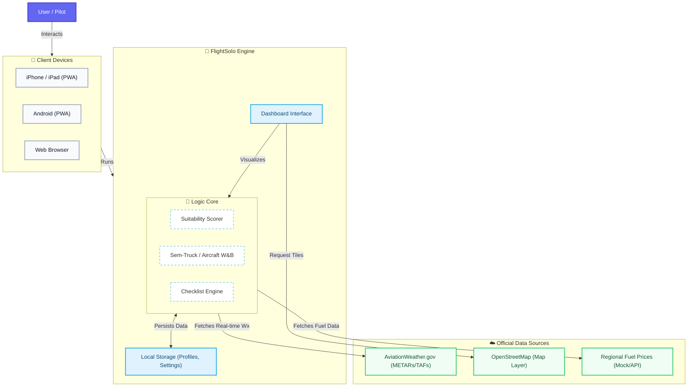

# FlightSolo ✈️

**FlightSolo** is a next-generation pre-flight briefing and suitability analysis tool for pilots. It simplifies complex weather data into actionable "Go/No-Go" decisions based on your personal minimums, aircraft capabilities, and training profile.

  

---

## 🌍 Ecosystem Overview

The following diagram illustrates how FlightSolo connects your devices to official aviation data sources, processing everything locally for a fast and private experience.



### Key Components
1.  **Client Devices**: Functions as a Progressive Web App (PWA). Can be installed on iOS and Android home screens for a native-like experience.
2.  **Logic Engine**: All suitability calculations happen **in your browser**. Your personal minimums and aircraft data never leave your device.
3.  **Data Sources**:
    *   **NOAA/AWS**: Real-time METARs, TAFs, and NOTAMs.
    *   **OpenStreetMap**: Detailed map tiles for route visualization.

---

## ✨ Features

### 🚦 Smart Suitability Analysis
*   **Personal Minimums**: Configure ceiling, visibility, and wind limits for different profiles (e.g., "Student Solo", "Dual Training").
*   **Automatic Scoring**: Instantly see "Go", "Marginal", or "No-Go" status for current and future conditions.
*   **Detailed Breakdown**: View exactly *why* a flight is unsafe (e.g., "Crosswind 15kt > Limit 12kt").

### 🗺️ Route & Briefing Tools
*   **Interactive Map**: Visualize your route with polyline connections between airports.
*   **Route Weather**: Check current conditions at departure, destination, and key waypoints.
*   **Runway Winds**: Integrated calculator for headwind/crosswind components using real-time METAR data.

### 📱 Modern Experience
*   **Dark Mode**: System-aware dark theme for night flying.
*   **Offline-First Architecture**: Caches recent data and app resources.
*   **Aircraft Manager**: Store performance profiles for your fleet.
*   **Legal Compliance**: Viewing of raw METAR/TAF text and comprehensive disclaimer/legal modals.

---

## 🛠️ Tech Stack

*   **Frontend**: React 19, TypeScript
*   **Build Tool**: Vite
*   **Styling**: Tailwind CSS v4
*   **State**: React Hooks + LocalStorage
*   **Maps**: Leaflet / React-Leaflet
*   **Charts**: Custom SVG implementation (Timeline)

---

## 🚀 Getting Started

### Prerequisites
*   Node.js (v18+)
*   npm or yarn

### Installation

1.  Clone the repository:
    ```bash
    git clone https://github.com/victorrodriguez/pilotweatherbrief.git
    cd pilotweatherbrief
    ```

2.  Install dependencies:
    ```bash
    npm install
    ```

3.  Start the development server:
    ```bash
    npm run dev
    ```

4.  Open `http://localhost:5173` in your browser.

---

## 📄 License & Disclaimer
This project is for **simulation and training purposes only**. Always obtain a standard briefing from official sources (e.g., 1800wxbrief.com) before real-world flight operations.

Created by Victor Rodriguez.
