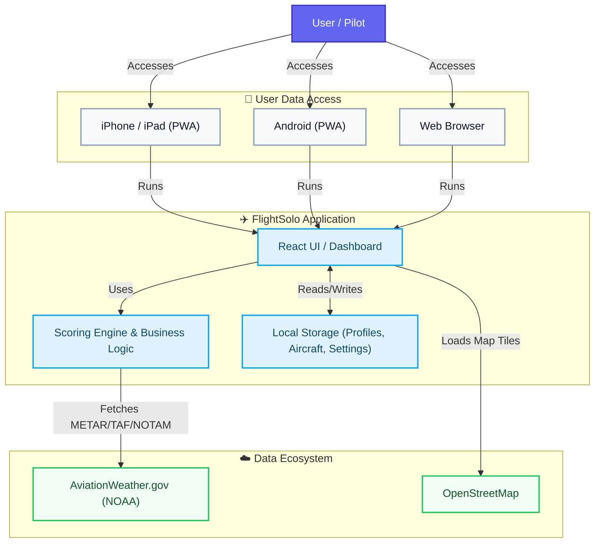

```mermaid
graph TD
    %% Nodes
    User["User / Pilot"]
    
    subgraph Devices ["📱 User Data Access"]
        iPhone["iPhone / iPad (PWA)"]
        Android["Android (PWA)"]
        Web["Web Browser"]
    end

    subgraph App ["✈️ FlightSolo Application"]
        UI["React UI / Dashboard"]
        Logic["Scoring Engine & Business Logic"]
        Store["Local Storage (Profiles, Aircraft, Settings)"]
    end

    subgraph External ["☁️ Data Ecosystem"]
        NOAA["AviationWeather.gov (NOAA)"]
        OSM["OpenStreetMap"]
    end

    %% Edge Connections
    User -->|Accesses| iPhone
    User -->|Accesses| Android
    User -->|Accesses| Web

    iPhone -->|Runs| UI
    Android -->|Runs| UI
    Web -->|Runs| UI

    UI <-->|Reads/Writes| Store
    UI -->|Uses| Logic
    
    Logic -->|Fetches METAR/TAF/NOTAM| NOAA
    UI -->|Loads Map Tiles| OSM

    %% Styling
    classDef user fill:#6366f1,stroke:#4338ca,stroke-width:2px,color:white;
    classDef device fill:#f8fafc,stroke:#94a3b8,stroke-width:2px,color:#0f172a;
    classDef app fill:#e0f2fe,stroke:#0ea5e9,stroke-width:2px,color:#0c4a6e;
    classDef ext fill:#f0fdf4,stroke:#22c55e,stroke-width:2px,color:#14532d;

    class User user;
    class iPhone,Android,Web device;
    class UI,Logic,Store app;
    class NOAA,OSM ext;
```
